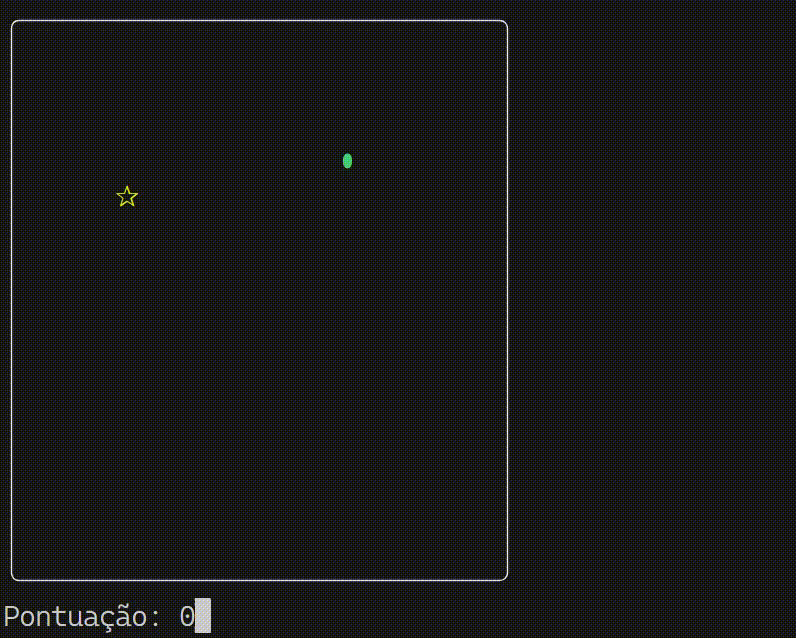

# 🐍 Snake Game (Terminal)

Bem-vindo ao **Snake Game**! Este é uma recriação do clássico "jogo da cobrinha", desenvolvido para rodar diretamente no seu terminal (Prompt de Comando) do Windows usando Python.

O objetivo é simples: coma os itens para crescer e evite bater nas paredes ou no próprio corpo.



## 🎮 Como Jogar

O jogo é controlado pelo teclado. Você pode usar tanto as **setas direcionais** quanto as teclas **WASD**.

| Ação | Teclas (Opção 1) | Teclas (Opção 2) |
| :--- | :---: | :---: |
| **Mover para Cima** | `W` | `↑` (Seta Cima) |
| **Mover para Baixo** | `S` | `↓` (Seta Baixo) |
| **Mover para Esquerda** | `A` | `←` (Seta Esq.) |
| **Mover para Direita** | `D` | `→` (Seta Dir.) |

### Regras:
1.  Você é a **cobra verde** (`⬮`).
2.  O objetivo é coletar o **item amarelo** (`✰`).
3.  Cada item coletado aumenta sua pontuação em **1 ponto** e faz a cobra crescer.
4.  O jogo acaba se você bater nas **bordas brancas** ou encostar no **próprio corpo**.

---

## 💻 Requisitos

Para rodar este jogo, você precisa de:

* **Sistema Operacional:** Windows (O jogo utiliza a biblioteca `msvcrt`, que é exclusiva do Windows).
* **Python 3:** Instalado no seu computador.

> **Nota:** Se você ainda não tem o Python, pode baixá-lo gratuitamente no site oficial: [python.org](https://www.python.org/downloads/).

---

## 🚀 Como Rodar o Jogo

Siga os passos abaixo para começar a jogar:

1.  **Baixe os arquivos:**
    * Faça o download deste repositório (clique no botão verde "Code" e depois em "Download ZIP") e extraia a pasta.

2.  **Abra o Terminal:**
    * Navegue até a pasta onde você salvou o arquivo do jogo.
    * Clique com o botão direito em um espaço vazio da pasta e selecione "Abrir no Terminal" (ou abra o CMD e use o comando `cd` para chegar até a pasta).

3.  **Execute o comando:**
    Digite o seguinte comando e aperte `Enter`:

    ```bash
    python nome_do_arquivo.py
    ```
    *(Substitua `nome_do_arquivo.py` pelo nome real do arquivo, por exemplo: `snake.py` ou `main.py`)*

---

## 🛠️ Detalhes Técnicos (Para Curiosos)

O jogo foi construído utilizando apenas bibliotecas padrão do Python, sem necessidade de instalações complexas externas:

* `os`: Para limpar a tela e ajustar configurações do terminal.
* `random`: Para gerar a posição aleatória da comida.
* `time`: Para controlar a velocidade do jogo (o "framerate").
* `msvcrt`: Para detectar as teclas pressionadas em tempo real no Windows sem precisar apertar "Enter".

---

## 📝 Licença

Este projeto é de código aberto. Sinta-se à vontade para baixar, modificar e melhorar o código!